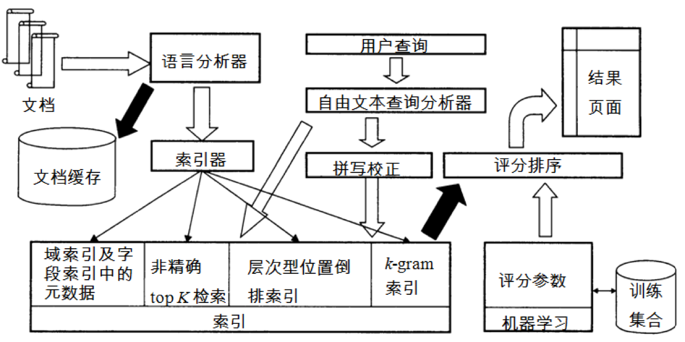

# 1. 倒排索引布尔检索
词项-文档矩阵  
采用定长数组存储文档ID是不可行的  
通常采用变长表的方式（vector、list）
每个词项中按照docID排序  
布尔查询的处理：  
- AND查询，倒排记录表求交集，复杂度O(len1+len2)；  
- OR查询，倒排记录表求并集，复杂度O(1)；
- NOT查询，倒排记录表的减，复杂度O(len1+len2)；

布尔表达式的查询优化：
- AND查询，从长度最小的表开始合并；  
- 布尔表达式转化为合取范式，结合AND查询优化策略；
- 跳表；

优缺点  
# 2. 词汇表与倒排记录表  
中文分词方法：  
- 词典：正向最大匹配和逆向最大匹配；新词问题二义问题；解决：规则+统计；  
- 规则+统计，条件随机场；
- 搜索引擎中的中文分词法：大词典+统计+启发式规则；  

去除停用词：词典  
现代搜索引擎倾向于不去除停用词：良好的索引压缩之后停用词占据资源很小，良好的查询优化策略之后不会增加查询开销，停用词有时候还是有大用处的。  
例子：to be or not to be.  
词条归一化成词项：同义词归一化，拼写错误处理，词形合并，词干还原
归一化工具：stemmer  
快速倒排记录表合并：skiplist  
短语查询：中国科学院：中国 AND 科学院 是不准确的  
解决方法：  
1.双词索引，两个词项合并成一个词项  
更长的短语查询：拆分成基于双词索引的布尔表达式  
扩展双词索引：对索引文档进行词性标注，满足词性规则的也划分为双词。例如catcher in the rye  
讲query也切分为扩展双词  
2.带位置信息的索引  
合并的时候考虑位置匹配，例子 to be or not to be.  
带位置信息的索引可处理临近查询，而双词索引则不能  
索引压缩可处理位置信息和双词索引带来的空间开销，一般是非位置索引的2-4倍。  
还可采用混合索引  
# 3. 词典与容错式检索
词项定位 两种数据结构：哈希表、树  
有些IR系统采用哈希表，有些IR系统采用树  
取决于词项数目，访问频次，更新频次  
哈希表的查询时间是常数，缺点：无法处理词项的变形和纠错、不支持前缀搜索、重新哈希。  
树：主要是B树，B+树。  
通配符查询的处理：  
1.mon\*采用B树查询非常容易，只需要返回mon子树的词项即可。    
\*mon可以将所有词项倒过来，构建一棵B树。  
通配符在中间的时候使用B树搜索的开销很大：mon\*st  
分别求满足mon\*和\*st的匹配词项，然后求交集，开销很大。  
2.轮排索引（轮排树）：  
将每个通配查询旋转，使得\*出现在末尾，将每个旋转之后的结果放在词典中。即在索引前面再加一层索引，索引用B树来组织。  
轮排索引的空间要大四倍以上。  
3.k-gram索引  
构建一个倒排索引，此时词典部分是所有的k-gram，倒排记录表部分是包含某个k-gram的所有词项  
相当于对词项再构建一个倒排索引(二级索引)  
2-gram拆分的例子：mon\*拆分成 $m AND mo AND on  
需要后续过滤：例如moon  
k-gram的空间消耗较小，轮排索引不需要后续过滤。  
拼写错误处理：  
两种拼写纠正的方法：词袋法，上下文敏感法。  
词袋法：单词间距离的计算：编辑距离(DP)、带权重的编辑距离(基于电脑键盘，手机键盘)、k-gram重叠率。  
k-gram拼写纠正：使用k-gram索引，根据jaccard相似度设定阈值减少匹配数目。  
上下文敏感的拼写纠正：统计结果、从历史检索库中检索  
基于发音的拼写错误：略  
拼写错误的处理：一般只给出一个结果，拼写错误检查的开销很大，但是拼写错误的检查，主流搜索引擎做的很好。  
# 4. 索引构建  
两种索引构建算法：BSBI(简单):基于块的排序索引构建算法  
SPIMI(更符合实际情况):内存式单遍扫描索引构建算法    
语料库：路透社1995-1996年所有新闻报道  
BSBI：构建倒排索引：词典与词项对应的倒排记录表。  
BSBI的主要思想是基于排序，遍历不到最后一篇文档的时候，倒排索引都是不完整的。  
基本思路：对每个块: (i) 倒排记录累积到10,000,000条, (ii) 在内存中排序, (iii) 写回磁盘，（iv）最后将所有的块合并成一个大的有序的倒排索引  
SPIMI：  
关键思想1: 对每个块都产生一个独立的词典–——不需要在块之间进行term-termID的映射  
关键思想2: 对倒排记录表不排序，按照他们出现的先后顺序排列  
基础上述思想可以对每个块生成一个完整的倒排索引  
这些独立的索引最后合并一个大索引  
对SPIMI进行索引压缩之后会更加高效  
分布式索引构建：MapReduce任务  
parser：1.主节点将一个数据片分配给一台空闲的分析器；2.分析器一次度一篇文档，输出词项文档对；3.按照词项首字母对词项文档对进行分区。  
inverter：倒排器收集对应某一词项分区的词项文档对，排序并写进倒排记录表。  
动态索引构建：磁盘维护主索引，内存维护辅助索引，新增的文档加入辅助索引中，空闲时间与主索引合并。  
对数合并算法  
# 5. 索引压缩 
无损压缩  
词项数目：heaps拟合，M=kT^b T是文档集大小（词条个数）  
词项分布：Zipf定律：第i常见的词项的频率cf(i)和1/i成正比，幂律分布  
## 5.1 词典压缩
将整部词典看成单一字符串，每个词项有一个指针指向特定位置。改进：将词典分块，每一块的块头有一个词项指针，字符串中的每个词项前面加上词项的长度。  
公共前缀编码  
压缩效率：  
方法 | 语料库词典大小
-----|------
词典，定长数组 | 11.2MB  
词典，长字符串+词项指针 |  7.6MB
词典，按块存储+k=4 | 7.1MB
词典，按块存储+前缀编码 | 5.9MB

## 5.2 倒排记录表压缩  
表示文档ID，存储文档ID间隔而不是文档ID本身。
> 倒排记录表中的文档是从高到低排序，顺序存储可以降低空间开销  
> 高频词项的倒排记录表的文档之间的间隔较小  

需要设计变长编码：VB码、gamma编码
# 6.文档评分、词项权重计算与向量空间模型
排序式检索，之前介绍的都是布尔检索  
查询文档匹配评分计算：  
jaccard系数  
不足：  
1.没有考虑词项频率。  
2.罕见词比高频词的信息量更大，jaccard系数没有体现这一点。  
3.没有考虑文档长度因素。  

词袋模型  
tf-idf  
特点：
1.随着词项频率的增大而增大
2.随着词项罕见度的增大而增大  

二值关联矩阵->词频矩阵->权重矩阵  
将文档表示为向量：维度很高，很稀疏  
将查询表示成向量：对查询做文档同样的处理
计算余弦相似度  
长度规整处理  
另外一种权重计算方法：BM25  

# 7.完整检索系统中的评分计算
与用户的相关行为数据相结合。  
用户的摘要阅读行为，用户的点击行为。  
为什么采用余弦相似度：距离函数不适合度量相似度。  
回转长度归一化：余弦归一化具有偏向于短文档的问题。  
回转归一化策略会使短文档的相似度降低而长文档的相似度提高。  
结果排序的实现：将词项频率tf也存入到倒排索引中去。一般存储的是整数词频，为了索引压缩。  
精确top K检索以及加速办法：  
从文档集的所有文档中找出K个离查询最近的文档  
加速思路：
1.如何加快余弦相似度计算。  
2.如何不排序直接选出top k个文档。  
3.能否不需要计算所有N篇文档的得分。    
快速计算余弦：query去权重即相当于关键词在文档中的权重相加、map-reduce  
堆法N中选K  
设定阈值提前终止运算  

非精确top K检索的可行性。  
找到一个文档集A,它包含了参与最后竞争的候选文档,其中K<|A|<<N。A不必包含前K篇得分最高的文档,但是它应该包含很多和前K篇文档得分相近的文档。  
从A中寻找得分最高的K篇文章。适合于任何相似度的计算，适合于自由文本查询，不适合布尔查询和短语查询。    
1.只考虑那些词项的考虑包含多个查询词项(一个特例是包含全部查询词项)的文档idf值超过一定阈值的文档。  
2.考虑包含多个查询词项(一个特例是包含全部查询词项)的文档。  
缓存思想：胜者表、静态评分（网页质量，pagerank）  
对于每一个词项，计算出r个最高权重的文档，保存在胜者表。胜者表可以通过倒排记录表文档排序实现。  
静态评分的分值也可以用来排序倒排记录表。  
两者结合，即维护一张静态评分加tf-idf值最高的文档。检索时仅仅对胜者表进行处理。  
高端表低端表：高端表不足K篇文档的时候，再对低端表进行处理。  
提前结束法：设定阈值。  
簇剪枝：随机选择√n篇文档作为master,对于其他文档，计算离该文档最近的master。  
给定查询Q，先计算master，再在master和follower中找到k篇。  

完整的检索系统示意图：  
</img>  
层次型位置倒排索引：按照不同domain词项的重要性建立层次。如二级层次：标题一层，内容一层。普遍认为google使用了层次索引。    
文档缓存：生成文档摘要；  
域索引：按照不同的域进行索引，如文档正文，文档中所有高亮的文本，锚文本、元数据字段中的文本等等；  
基于机器学习的排序函数；  
邻近式排序 (如, 查询词项彼此靠近的文档的得分应该高于查询词项距离较远的文档)。  
使用map-reduce计算海量文本相似度。 [链接](http://blog.csdn.net/stdcoutzyx/article/details/9288589)  
# 8.检索评价
混淆矩阵，相关/不相关，检索出/未检索出；准确率，召回率，F1值。  
大型系统的召回率难以计算，一般采用top k进行评估。还有第一个结果的点击率，点击的历史状况等。  
# 9.结果摘要、相关反馈与查询扩展  
摘要：静态摘要、动态摘要。  
静态摘要：将文档中重要的句子作为摘要。（借助于机器学习、NLP，现在的方法还不够成熟）。  
动态摘要：给出一个窗口或多个窗口内的结果，包含一个或多个查询词。需要对文档进行缓存。  
检索中提高召回率的方法：相关反馈与查询扩展。  
交互式相关反馈：在初始检索结果的基础上，通过用户交互指定哪些文档相关或不相关，然后改进检索的结果。  
查询扩展：通过同义词词典，以及后来的语义网，语义分析，知识图谱。  
用户反馈：显式用户反馈、隐式用户反馈。  
相关反馈中的核心概念：文档集的质心。利用Rocchio算法实现相关反馈。  
查询扩展法：
1.人工词典法。  
2.自动词典法。（自动推导出同义词，根据词语的共现统计信息）  
3.外部资源法。（比如基于查询日志挖掘出查询等价类）
查询扩展可能会降低正确率。  
自动词典法：通过分析文档集中的词项分布来自动生成同(近)义词词典。  
查询日志挖掘：不同查询的相同点击，再次查询，查询结果的相似度等。  
# 10.概率检索模型
向量空间模型的优缺点：  
优点：  
简洁直观，可以应用到很多其他领域(文本分类、生物信息学)。  
支持部分匹配和近似匹配，结果可以排序。  
检索效果不错。  
缺点：  
理论上不够严谨，往往基于直觉的经验性公式。  
词项之间的独立性假设与实际不符：实际上，词项的出现之间是有关系的，并不是完全独立的。如：“王励勤” “乒乓球”的出现不是独立的。  
概率检索模型：  
> 定义3个随机变量R、Q、D：相关度R={0,1}，查询Q可以是q1,q2,…中的一个查询，文档D可以是d1,d2,…中的一篇文档，则可以通过计算条件概率P(R=1|Q=q,D=d)来度量文档和查询的相关度。  

典型的概率检索模型有LR、BIM、BM25、贝叶斯网络模型。
LR：6个特征函数，求beta1—beta6。  
BIM、BM25略。
# 11.统计语言模型SLM
条件概率公式，一元、二元、三元语言模型。  
零概率处理：平滑。  
SLMIR模型：QLM模型、翻译模型、KL距离模型。  
QLM求解步骤：  
第一步：根据文档D(样本)，估计文档模型MD(总体)，在一元模型下，即计算所有词项 w的概率P(w|MD)  
第二步：计算在模型MD下生成查询Q的似然(即概率)  
第三步：按照得分对所有文档排序  
# 朴素贝叶斯

