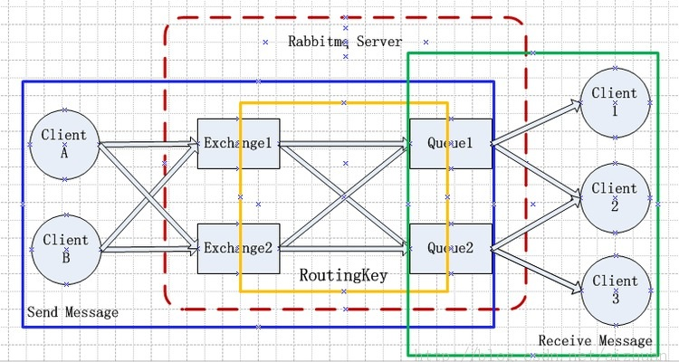

# summary找工作技能树
## 1. Data Structure
### 1.1 线性表、链表, 队列, 堆栈
线性表
链表: 链表相加（进位与长度不一的边界问题）、链表部分翻转（给定区间翻转）、链表去重（删除节点）、链表划分（快速排序）、链表公共节点（链表长度，遍历）  
队列：图的拓扑排序（DAG）、最短路径条数（单源最短路径退化成广度优先搜索）  
堆栈：括号匹配（栈）、逆波兰表达式（栈）、树的三种遍历的递归与非递归形式（后序遍历非递归，双栈）  
### 1.2 字符串
字符串处理（学会借助std::string与STL中的api）  
字符串循环移位（三次拷贝、(x'y')'=yx）  
LCS、LIS（动态规划、二维长度数组、滚动数组、LIS转化成LCS）  
字符串全排列（递归、有重复字母递归、非递归借助字典序下一个排列、哈希降低时间复杂度）、字典序的下一个排列  
字符串编辑距离（动态规划）
字符串旋转  
最长回文子串（Manacher算法）  
atoi实现       
KMP  
DFA、NFA与正则表达式  
海量字符串还是要借助于Trie树、哈希、BF    
### 1.3数组
天平称量问题（理论下界、3^n>=12*2）  
局部最大值（二分查找）  
第一个缺失的整数（循环不变式）  
旋转数组的最小值（二分查找）  
寻找0子数组（和数组相邻元素差的绝对值的最小值）  
最大子数组和（DP）  
荷兰国旗问题（快速排序中的partition思想）  
Cantor数组  
排序数组最大间隔  
子集和数问题    
### 1.4 树
树转换成二叉树（左孩子右兄弟）  
二叉查找树：增删改查（删右子树最左子孙代替删除位置）  
先序中序后序层次遍历：递归、非递归；先中求后、中后求先  
平衡二叉树：  
- 四种分类：LL、LR、RL、RR  
- 四种旋转：左旋和右旋、单旋转和双旋转  
- 增删改查

堆
B树及其变种：分裂合并节点、B树与B+树区别  
其他树：RB-tree、区间树、二项堆、fibonacci堆
应用：huffman树、字典树(双数组字典树)、线段树、并查集  
#### trie树
字典树对应有限状态自动机    
双数组字典树（待总结）  
### 1.5 图
并查集  
图的存储：链接表、链接矩阵、稀疏图存储  
最短路径：Dijkstra、Floyd、Bellman-Ford  
最小生成树：Prim、Kruskal、带权的最小生成树  
图搜索：DFS、BFS、A*、alpha/beta剪枝 
拓扑排序   
最大流最小割 
回路问题：欧拉图、哈密顿图、TSM  
二分图匹配   
### 1.6 哈希表
常用哈希函数：直接地址法、平方取中法、折叠法、取余法  
字符串的哈希函数：字符串->整数，BKDR哈希，AP哈希
冲突解决：开放定址法、链地址法、再哈希法
实践：使用BKDRhash作为基础的哈希函数；使用链地址法作为冲突处理方法，实现哈希表的插入与查找工作   
应用：哈希分片：Round Robin、Virtual Box、一致哈希  
### 1.7 Data Structure in Big Data
bloom filter、bitmap  
skiplist  
LSM树  
一致哈希 Cuckoo哈希  
### 1.8 排序
插入排序  
选择排序  
冒泡排序  
shell排序  
堆排序  
归并排序  
快速排序  
基数排序  
桶排序  
外部排序  
复杂度、稳定性比较
## 2. Algorithm
### 2.1 初等数论
素数与整数唯一分解  
最大公约数与最小公倍数  
高精度加减乘除
进制转换  
### 2.2 组合数学
加法与乘法原理  
Fibonacci数：O(n)、O(logn)  
Catalan数：矩阵连乘的计算次序、合法出栈次序、圆桌握手、二叉排序数总数、凸多边形三角划分  
排列组合  
### 2.3 概率统计
古典概率模型  
抽样原理  
### 2.4 递归与分治
递归  
分治：最大最小值、矩阵乘法、骑士周游问题、大整数乘法、棋盘覆盖问题  
### 2.5 贪心
背包问题  
机器任务调度算法：多机调度问题、活动安排问题  
### 2.6 动态规划
最优子结构  
递推表达式  
空间换时间  
应用：矩阵连乘问题、LCS、LIS、多段图最短路径、资源分配问题
### 2.7 搜索技术
盲目搜索算法：二分搜索、DFS、BFS  
回溯法：八皇后问题及其并行求解  
启发式搜索：A*算法
博弈问题：博弈树  
alpha-beta剪枝
### 2.8 手写代码
字符串：编辑距离、最长公共子串、最长公共子序列
链地址法哈希表，BKDR哈希函数  
所有排序算法  
单例模式  
智能指针简单实现  
strcpy,itoa,
## 3.Cpp
### 3.1 语言基础
基本数据类型：基本数据类型的种类、整型几种形式与区别、常量与变量  
操作符：优先级，前自增与后自增，三元运算符  
变量：左值与右值、变量初始化方式、变量声明与定义、变量作用域、变量的存储类型  
引用：引用的概念、const与非const引用  
枚举类型、结构体、共用体
C与C++的区别和联系  
编程规范：匈牙利命名法  
const与#define的区别  
mutable关键字  
C与C++中const的区别  
sizeof对齐规则  
sizeof与strlen：类型所占内存大小；以\0结尾的字符串长度  
位运算：判断一个数X是否是2^N次方，实现加法运算，交换a,b，
### 3.2 流程控制
条件语句  
循环语句  
switch语句  
递归语句  
### 3.3 输入输出
输入输出流：概念，如何重载输入输出流  
文件输入、输出：文件输入输出的方式  
### 3.4 预处理  
宏定义、宏定义的展开、宏定义与typedef  
include  
内联函数  
### 3.5 指针与引用
指针初始化与赋值  
const对象的指针和const指针  
数组指针和指针数组  
函数指针  
void*  
this指针  
指针与句柄  
指针和引用的区别    
值传递、地址传递、引用传递
### 3.6 函数  
函数与作用域、形参与实参、引用形参与指针形参、不确定个数参数  
类成员函数、类静态函数  
函数重载与运算符重载
函数匹配二义性处理  
### 3.7 面向对象
面向对象、面向过程、函数式编程  
封装、继承、多态  
类、抽象类  
类成员的访问控制、静态类成员    
类创建时默认生成的函数  
构造函数：赋值函数和copy构造函数、成员初始化列表、
析构函数  
友元函数与友元类    
重载与覆盖  
私有继承、虚函数继承与虚继承、多重继承  
虚函数与纯虚函数 虚函数指针与虚函数表 
运算符重载与RTTI  
构造函数与析构函数的调用时机  
### 3.8 模板与泛型编程
[函数模板与类模板](http://blog.csdn.net/welcome_xu/article/details/7554595)  
[typename](http://baike.baidu.com/link?url=F3AXPc2imfxBPi7M_RqKlqWmldrFN4QSw4-g7MQ0DdO3YlYDrsRD_AzsYiBFuAx8meUhj-pDluLoXtjZm1WVz_)关键字  
函数模板的类型推断  
[函数模板重载](https://github.com/WalnutATiie/thinkngcpp/blob/master/code/C05/MinTest.cpp)  

### 3.9 异常处理
抛出异常与捕获异常、异常匹配  
标准异常std::exception  
异常使用场景  
### 3.10 C++11新特性
long long类型  
nullptr表示空指针  
constexpr用于表示常量表达式。  
noexcept可以用于指示一个函数是否会抛出异常，同时可以用作运算符判定一个函数是否承诺不抛出异常。  
新增基础类型、容器类型、new分配内存时的列表初始化。构建临时变量时也可以直接使用列表初始化。  
可以直接对类内成员进行初始化/列表初始化。
### 3.11 C++对象模型
虚函数表解析。
- 含有虚函数或其父类含有虚函数的类，编译器都会为其添加一个虚函数表，vptr。

虚基类表解析。
- 虚继承产生虚基类表(vbptr)，虚基类表的内容与虚函数表完全不同。

对象模型概述.
- 简单对象模型、表格驱动对象模型，以及非继承情况下的C++对象模型。

继承下的C++对象模型。  
分析C++类对象在下面情形中的内存布局：
- 单继承：子类单一继承自父类，分析了子类重写父类虚函数、子类定义了新的虚函数情况下子类对象内存布局。
- 多继承：子类继承于多个父类，分析了子类重写父类虚函数、子类定义了新的虚函数情况下子类对象内存布局，同时分析了非虚继承下的菱形继承。
- 虚继承：分析了单一继承下的虚继承、多重基层下的虚继承、重复继承下的虚继承。

## 4. STL  
> 子曾经曰过：要用好STL这个大轮子  

### 4.1 

## 5. Effective and More Effective Cpp
## 6. Python  
## 7. Linux环境与Shell
## 8. Linux服务器编程
### 8.1 线程安全的对象生命周期管理
用mutex来实现线程安全的类成员函数（如：单例模式的多线程计数count）。  
mutex并不能保护析构函数。  
一劳永逸的方法是采用引用计数型指针shared_ptr。  
C++中内存问题的主要原因：  
- 缓冲区溢出
- 空悬指针/野指针
- 重复释放
- 内存泄漏
- 不配对的new[]/delete  
- 内存碎片  
### 8.X epoll()和kqueue()的底层原理
网卡设备对应一个中断号, 当网卡收到网络端的消息的时候会向CPU发起中断请求, 然后CPU处理该请求. 通过驱动程序 进而操作系统得到通知, 系统然后通知epoll, epoll通知用户代码. 大致流程是这样。
作者：蓝形参
来源：[知乎](https://www.zhihu.com/question/20122137/answer/14049112)
著作权归作者所有，转载请联系作者获得授权。

首先我们来定义流的概念，一个流可以是文件，socket，pipe等等可以进行I/O操作的内核对象。
不管是文件，还是套接字，还是管道，我们都可以把他们看作流。
之后我们来讨论I/O的操作，通过read，我们可以从流中读入数据；通过write，我们可以往流写入数据。现在假定一个情形，我们需要从流中读数据，但是流中还没有数据，（典型的例子为，客户端要从socket读如数据，但是服务器还没有把数据传回来），这时候该怎么办？
阻塞。阻塞是个什么概念呢？比如某个时候你在等快递，但是你不知道快递什么时候过来，而且你没有别的事可以干（或者说接下来的事要等快递来了才能做）；那么你可以去睡觉了，因为你知道快递把货送来时一定会给你打个电话（假定一定能叫醒你）。
非阻塞忙轮询。接着上面等快递的例子，如果用忙轮询的方法，那么你需要知道快递员的手机号，然后每分钟给他挂个电话：“你到了没？”
很明显一般人不会用第二种做法，不仅显很无脑，浪费话费不说，还占用了快递员大量的时间。
大部分程序也不会用第二种做法，因为第一种方法经济而简单，经济是指消耗很少的CPU时间，如果线程睡眠了，就掉出了系统的调度队列，暂时不会去瓜分CPU宝贵的时间片了。

为了了解阻塞是如何进行的，我们来讨论缓冲区，以及内核缓冲区，最终把I/O事件解释清楚。缓冲区的引入是为了减少频繁I/O操作而引起频繁的系统调用（你知道它很慢的），当你操作一个流时，更多的是以缓冲区为单位进行操作，这是相对于用户空间而言。对于内核来说，也需要缓冲区。
假设有一个管道，进程A为管道的写入方，Ｂ为管道的读出方。
假设一开始内核缓冲区是空的，B作为读出方，被阻塞着。然后首先A往管道写入，这时候内核缓冲区由空的状态变到非空状态，内核就会产生一个事件告诉Ｂ该醒来了，这个事件姑且称之为“缓冲区非空”。
但是“缓冲区非空”事件通知B后，B却还没有读出数据；且内核许诺了不能把写入管道中的数据丢掉这个时候，Ａ写入的数据会滞留在内核缓冲区中，如果内核也缓冲区满了，B仍未开始读数据，最终内核缓冲区会被填满，这个时候会产生一个I/O事件，告诉进程A，你该等等（阻塞）了，我们把这个事件定义为“缓冲区满”。
假设后来Ｂ终于开始读数据了，于是内核的缓冲区空了出来，这时候内核会告诉A，内核缓冲区有空位了，你可以从长眠中醒来了，继续写数据了，我们把这个事件叫做“缓冲区非满”
也许事件Y1已经通知了A，但是A也没有数据写入了，而Ｂ继续读出数据，知道内核缓冲区空了。这个时候内核就告诉B，你需要阻塞了！，我们把这个时间定为“缓冲区空”。
这四个情形涵盖了四个I/O事件，缓冲区满，缓冲区空，缓冲区非空，缓冲区非满（注都是说的内核缓冲区，且这四个术语都是我生造的，仅为解释其原理而造）。这四个I/O事件是进行阻塞同步的根本。（如果不能理解“同步”是什么概念，请学习操作系统的锁，信号量，条件变量等任务同步方面的相关知识）。

然后我们来说说阻塞I/O的缺点。但是阻塞I/O模式下，一个线程只能处理一个流的I/O事件。如果想要同时处理多个流，要么多进程(fork)，要么多线程(pthread_create)，很不幸这两种方法效率都不高。
于是再来考虑非阻塞忙轮询的I/O方式，我们发现我们可以同时处理多个流了（把一个流从阻塞模式切换到非阻塞模式再此不予讨论）：
while true {
for i in stream[]; {
if i has data
read until unavailable
}
}
我们只要不停的把所有流从头到尾问一遍，又从头开始。这样就可以处理多个流了，但这样的做法显然不好，因为如果所有的流都没有数据，那么只会白白浪费CPU。这里要补充一点，阻塞模式下，内核对于I/O事件的处理是阻塞或者唤醒，而非阻塞模式下则把I/O事件交给其他对象（后文介绍的select以及epoll）处理甚至直接忽略。

为了避免CPU空转，可以引进了一个代理（一开始有一位叫做select的代理，后来又有一位叫做poll的代理，不过两者的本质是一样的）。这个代理比较厉害，可以同时观察许多流的I/O事件，在空闲的时候，会把当前线程阻塞掉，当有一个或多个流有I/O事件时，就从阻塞态中醒来，于是我们的程序就会轮询一遍所有的流（于是我们可以把“忙”字去掉了）。代码长这样:
while true {
select(streams[])
for i in streams[] {
if i has data
read until unavailable
}
}
于是，如果没有I/O事件产生，我们的程序就会阻塞在select处。但是依然有个问题，我们从select那里仅仅知道了，有I/O事件发生了，但却并不知道是那几个流（可能有一个，多个，甚至全部），我们只能无差别轮询所有流，找出能读出数据，或者写入数据的流，对他们进行操作。
但是使用select，我们有O(n)的无差别轮询复杂度，同时处理的流越多，每一次无差别轮询时间就越长。再次
说了这么多，终于能好好解释epoll了
epoll可以理解为event poll，不同于忙轮询和无差别轮询，epoll之会把哪个流发生了怎样的I/O事件通知我们。此时我们对这些流的操作都是有意义的。（复杂度降低到了O(k)，k为产生I/O事件的流的个数，也有认为O(1)的[更新 1]）
在讨论epoll的实现细节之前，先把epoll的相关操作列出[更新 2]：
epoll\_create 创建一个epoll对象，一般epollfd = epoll\_create()
epoll\_ctl （epoll\_add/epoll\_del的合体），往epoll对象中增加/删除某一个流的某一个事件
比如
epoll\_ctl(epollfd, EPOLL\_CTL\_ADD, socket, EPOLLIN);//有缓冲区内有数据时epoll_wait返回
epoll\_ctl(epollfd, EPOLL\_CTL\_DEL, socket, EPOLLOUT);//缓冲区可写入时epoll_wait返回
epoll\_wait(epollfd,...)等待直到注册的事件发生
（注：当对一个非阻塞流的读写发生缓冲区满或缓冲区空，write/read会返回-1，并设置errno=EAGAIN。而epoll只关心缓冲区非满和缓冲区非空事件）。
一个epoll模式的代码大概的样子是：
while true {
active\_stream[] = epoll\_wait(epollfd)
for i in active\_stream[] {
read or write till unavailable
}
}

## 9. Web数据挖掘
## 10. 信息检索
## 1X. 其他知识点
### 1X.1 Redis
一、五种基本的数据类型
String  list  hash  set  sorted set(排序集合)
二、五种特性
（1）inmemory  在内存中   与cache类似，是一个以key-value存储的缓存系统
（2）弱化事务   基本是没有事务概念的，只有在某些地方会对事务进行遍历，而且它的遍历也不是遇到错误就停下来，而是遇到错误不管也不处理。
（3）集群环境
（4）Key-value查询
（5）脚本语言支持
三、
redis是一个单线程的系统，
支持持久化（cache不支持持久化），
订阅/发布功能
（
Redis 的消息队列功能
A    B    C
如果A,B,C服务器都订阅redis的某个key，那么就可以通过A在这个key里发布信息，放到redis的消息队列，redis会把消息推送到所有订阅了这个key的B，C服务器。Redis本身是不存储这个数据的。
）
四、redis和Memcache的区别
Memcache不能集群，最大为1M
Redis可以集群，最大为1G
五、Redis 常用于web服务器和数据库之间，充当缓存系统，因为其具有持久化功能，可以连接数据库，大量的数据放在redis里面缓存，web服务器或者应用与redis缓存进行交互，可提高程序执行的性能。
   Web服务器——redis服务器——数据库
六、redis有一个第三方的图形界面 Redis Desktop Manager。不过并不是特别的好用。
七、Redis数据结构的各种命令
         http://redisdoc.com/  redis命令参考
String 类型 
List类型
Lpush  Rpush  Lpop  Rpop  Irange  BLpop Brpop阻塞版 
八、Session管理
九、集群服务
1、解决单节点故障
2、读写分离
                                Redis share
Web服务器 ——redis mater
                                Redis share
十、Redis充当Message Queue
消息队列    实现订阅/发布功能
十一、redis充当数据库服务器
十二、Redis目前需要解决的问题就是内存问题？
内存有限，游戏数据庞大，如何把redis内存中的数据写入到数据库中，或者从数据库中读出来数据。
1、序列化到本地
2、Redis是否支持数据写入到内存中
3、集群扩容，不过这只能解决容量的问题，不能解决游戏中大量死数据的问题
解决内存问题：主要还是要从如果从游戏死数据中分离出来活跃用户的角度下手。
方法：合服的时候清除死数据，判断玩家playerBean数据是否超过某一时间，超过时间设置玩家playCache里状态标识位为非法。在从数据库大量load玩家playerCache数据到内存中，状态非法和数据为空的被剔除掉。
### 1X.2 Kafka
Kafka是一种分布式的，基于发布/订阅的消息系统。  

常用Message Queue对比：  
RabbitMQ  
RabbitMQ是使用Erlang编写的一个开源的消息队列，本身支持很多的协议：AMQP，XMPP, SMTP, STOMP，  
也正因如此，它非常重量级，更适合于企业级的开发。同时实现了Broker构架，这意味着消息在发送给客户端时先在中心队列排队。
对路由，负载均衡或者数据持久化都有很好的支持。  
Redis  
Redis是一个基于Key-Value对的NoSQL数据库，开发维护很活跃。虽然它是一个Key-Value数据库存储系统，但它本身支持MQ功能，所以完全可以当做一个轻量级的队列服务来使用。对于RabbitMQ和Redis的入队和出队操作，各执行100万次，每10万次记录一次执行时间。测试数据分为128Bytes、512Bytes、1K和10K四个不同大小的数据。实验表明：入队时，当数据比较小时Redis的性能要高于RabbitMQ，而如果数据大小超过了10K，Redis则慢的无法忍受；出队时，无论数据大小，Redis都表现出非常好的性能，而RabbitMQ的出队性能则远低于Redis。  
ZeroMQ  
ZeroMQ号称最快的消息队列系统，尤其针对大吞吐量的需求场景。ZMQ能够实现RabbitMQ不擅长的高级/复杂的队列，但是开发人员需要自己组合多种技术框架，技术上的复杂度是对这MQ能够应用成功的挑战。ZeroMQ具有一个独特的非中间件的模式，你不需要安装和运行一个消息服务器或中间件，因为你的应用程序将扮演了这个服务角色。你只需要简单的引用ZeroMQ程序库，可以使用NuGet安装，然后你就可以愉快的在应用程序之间发送消息了。但是ZeroMQ仅提供非持久性的队列，也就是说如果宕机，数据将会丢失。其中，Twitter的Storm 0.9.0以前的版本中默认使用ZeroMQ作为数据流的传输（Storm从0.9版本开始同时支持ZeroMQ和Netty作为传输模块）。  
ActiveMQ  
ActiveMQ是Apache下的一个子项目。 类似于ZeroMQ，它能够以代理人和点对点的技术实现队列。同时类似于RabbitMQ，它少量代码就可以高效地实现高级应用场景。  
Kafka/Jafka  
Kafka是Apache下的一个子项目，是一个高性能跨语言分布式发布/订阅消息队列系统，而Jafka是在Kafka之上孵化而来的，即Kafka的一个升级版。具有以下特性：快速持久化，可以在O(1)的系统开销下进行消息持久化；高吞吐，在一台普通的服务器上既可以达到10W/s的吞吐速率；完全的分布式系统，Broker、Producer、Consumer都原生自动支持分布式，自动实现复杂均衡；支持Hadoop数据并行加载，对于像Hadoop的一样的日志数据和离线分析系统，但又要求实时处理的限制，这是一个可行的解决方案。Kafka通过Hadoop的并行加载机制来统一了在线和离线的消息处理。Apache Kafka相对于ActiveMQ是一个非常轻量级的消息系统，除了性能非常好之外，还是一个工作良好的分布式系统。  
经验证，顺序写磁盘效率比随机写内存还要高，这是Kafka高吞吐率的一个很重要的保证。  

每一条消息被发送到broker时，会根据paritition规则选择被存储到哪一个partition。如果partition规则设置的合理，所有消息可以均匀分布到不同的partition里，这样就实现了水平扩展。（如果一个topic对应一个文件，那这个文件所在的机器I/O将会成为这个topic的性能瓶颈，而partition解决了这个问题）。  
对于传统的message queue而言，一般会删除已经被消费的消息，而Kafka集群会保留所有的消息，无论其被消费与否。当然，因为磁盘限制，不可能永久保留所有数据（实际上也没必要），因此Kafka提供两种策略去删除旧数据。一是基于时间，二是基于partition文件大小。例如可以通过配置$KAFKA_HOME/config/server.properties，让Kafka删除一周前的数据，也可通过配置让Kafka在partition文件超过1GB时删除旧数据。  
Kafka读取特定消息的时间复杂度为O(1)，即与文件大小无关，所以这里删除文件与Kafka性能无关，选择怎样的删除策略只与磁盘以及具体的需求有关。另外，Kafka会为每一个consumer group保留一些metadata信息—当前消费的消息的position，也即offset。这个offset由consumer控制。正常情况下consumer会在消费完一条消息后线性增加这个offset。当然，consumer也可将offset设成一个较小的值，重新消费一些消息。因为offet由consumer控制，所以Kafka broker是无状态的，它不需要标记哪些消息被哪些consumer过，不需要通过broker去保证同一个consumer group只有一个consumer能消费某一条消息，因此也就不需要锁机制，这也为Kafka的高吞吐率提供了有力保障。  
一条消息只有被“in sync” list里的所有follower都从leader复制过去才会被认为已提交。这样就避免了部分数据被写进了leader，还没来得及被任何follower复制就宕机了，而造成数据丢失（consumer无法消费这些数据）。而对于producer而言，它可以选择是否等待消息commit，这可以通过request.required.acks来设置。这种机制确保了只要“in sync” list有一个或以上的flollower，一条被commit的消息就不会丢失。  
这里的复制机制即不是同步复制，也不是单纯的异步复制。事实上，同步复制要求“活着的”follower都复制完，这条消息才会被认为commit，这种复制方式极大的影响了吞吐率（高吞吐率是Kafka非常重要的一个特性）。而异步复制方式下，follower异步的从leader复制数据，数据只要被leader写入log就被认为已经commit，这种情况下如果follwer都落后于leader，而leader突然宕机，则会丢失数据。而Kafka的这种使用“in sync” list的方式则很好的均衡了确保数据不丢失以及吞吐率。follower可以批量的从leader复制数据，这样极大的提高复制性能（批量写磁盘），极大减少了follower与leader的差距（前文有说到，只要follower落后leader不太远，则被认为在“in sync” list里）。  
每一个consumer实例都属于一个consumer group，每一条消息只会被同一个consumer group里的一个consumer实例消费。（不同consumer group可以同时消费同一条消息）。  
实际上，Kafka的设计理念之一就是同时提供离线处理和实时处理。根据这一特性，可以使用Storm这种实时流处理系统对消息进行实时在线处理，同时使用Hadoop这种批处理系统进行离线处理，还可以同时将数据实时备份到另一个数据中心，只需要保证这三个操作所使用的consumer在不同的consumer group即可。  
Kafka默认保证At least once，并且允许通过设置producer异步提交来实现At most once。  
在1台机器上跑多个实例对吞吐率的增加不会有太大帮忙，因为网卡已经基本饱和了  
需要注意的是，replication factor并不会影响consumer的吞吐率测试，因为consumer只会从每个partition的leader读数据，而与replicaiton factor无关。同样，consumer吞吐率也与同步复制还是异步复制无关。  
Kafka副本管理机制为ISR，最多允许n-1个副本故障。  
kafka通过zookeeper保存的管理信息和实现的功能有：
（1）侦测代理服务器和消息消费者的动态加入和删除。  
（2）当动态加入或者删除代理服务器以及消息消费者之后进行负载均衡。  
（3）维护消费者和消息topic以及数据分片的相互关系，并保存消费者当前读取消息的offset。  
（4）数据副本管理消息。  
网络传输使用SendFile系统调用。
### 1X.3 Elasticsearch
### 1X.4 Vim
ctags cscope
### 1X.5 gcc、gdb、valgrind、makefile
### 1X.6 Docker
### 1X.7 局部敏感哈希
simhash主要分为5个步骤：分词、哈希、加权、合并、降维。
分词之后对每个词计算哈希值(01)串，按照分词之后的权重对01串进行加权（其中0看成-1）然后将每个向量加起来之后降维（负数看成0，正数看成1）即可得到哈希值。哈希值之间的比较主要通过汉民距离进行比较，在3以内即可说明相似度比较高。  
汉民距离：异或之后的结果的1的个数即为汉民距离的大小。  
大量simhash值的比较，将simhash签名分成4份，利用抽屉原理，至少一份是完全相同的。  
simhash的运用：网页存储、网页重复判定、视频网站的重复、网盘网站的秒传。  
### 1X.8 HDFS、Spark
### 1X.9 UML关系图
[讲解](http://blog.csdn.net/suxinpingtao51/article/details/8011335)  
### 1X.10 SQL语句总结
1.基本查询：   
(1)我只想查询某个表的某列时：SELECT col1,col2 from table1过滤掉不要的列字段;   
(2)我想查询某行的信息时：使用where col1=1 and col2=2来过滤掉不要的行;   
(3)我们可以使用group by来aggregate 数据，汇总时，显示的字段一般是汇总函数;   
(4)我们可以使用having来过滤掉汇总后的数据;   
(5)我们可以使用order by 来对我们查询的结果进行排序如 order by col2; 解释：select用来查询关键字段;distinct的关键字段返回的是唯一的结果 between a and b:用来限制一个值的范围；like：用来过滤某列的文本数据;in:某个值是否在里面   
2.数据操作：   
(1)我想更新表中col2等于2的col1值变为1的一行数据：update table1 set col1=1 where col2=2   
(2)我想手工给table1插入数据：insert into table(col1,col2) values(1,2);   
(3)查询插入数据，这个开发中一定用到:insert into table1(col1)select col2 from table2   
3.视图（使用到复杂的查询） create view view1 as select co1 from table1 使用时select from view1   
4.关联表查询：   
(1)左关联：所有的行都从主表出即使子表中没有，一般包括多的拿来当主表；   
(2)内连接：主表和子表都有的行；   
(3)右关联和左关联意思一样；   
5.关联查询更新数据（这个好像很厉害） update t1 set a=1 from table1 t1 join table2 t2 on t1.id=t2.id where t1.col1=0 and t2.col2 is null;   
6.子查询： select from table1 where id in(select id from table2 where date>current\_timestamp) 
7.索引 create index index1 on table1(id) 索引可以加速我们的delete和update的操作  
8.非常有用的工具函数   
(1)字符串变为日期类型：to\_date(oracle,postgresql)、str\_to\_date(musql)   
(2)返回第一个字段不是null的字段：coalesce(col1,col2,"defualt");   
(3)返回当前时间current_timestamp   
(4)对两个查询结果做运算：union(返回两个表的所有数据)except（所有的行必须只有主表有，子表不能有） intersect：连个表都有的行    
9.汇总函数： count：返回行数 sum：返回该列的所有和 avg：返回该列的平均值 min/max:返回该列的最大或者最小值 具体参考下图：
### 1X.11 rabbitmq消息队列
子系统和模块通信、传统IPC。  
应用场景：  
1）信息的发送者和接收者如何维持这个连接，如果一方的连接中断，这期间的数据如何方式丢失？  
2）如何降低发送者和接收者的耦合度？  
3）如何让Priority高的接收者先接到数据？  
4）如何做到load balance？有效均衡接收者的负载？  
5）如何有效的将数据发送到相关的接收者？也就是说将接收者subscribe 不同的数据，如何做有效的filter。  
6）如何做到可扩展，甚至将这个通信模块发到cluster上？  
7）如何保证接收者接收到了完整，正确的数据？  
rabbitmq架构图  
  
exchange三种类型：direct、fanout、dispatch  
普通传输、任务分发机制（load blance）、topic、routine、RPC
## 11. 项目相关

